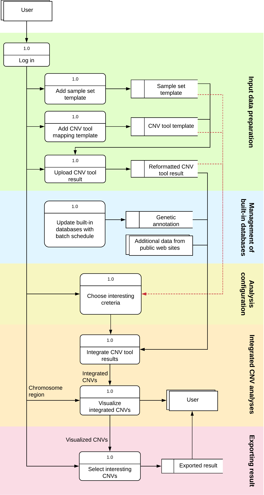
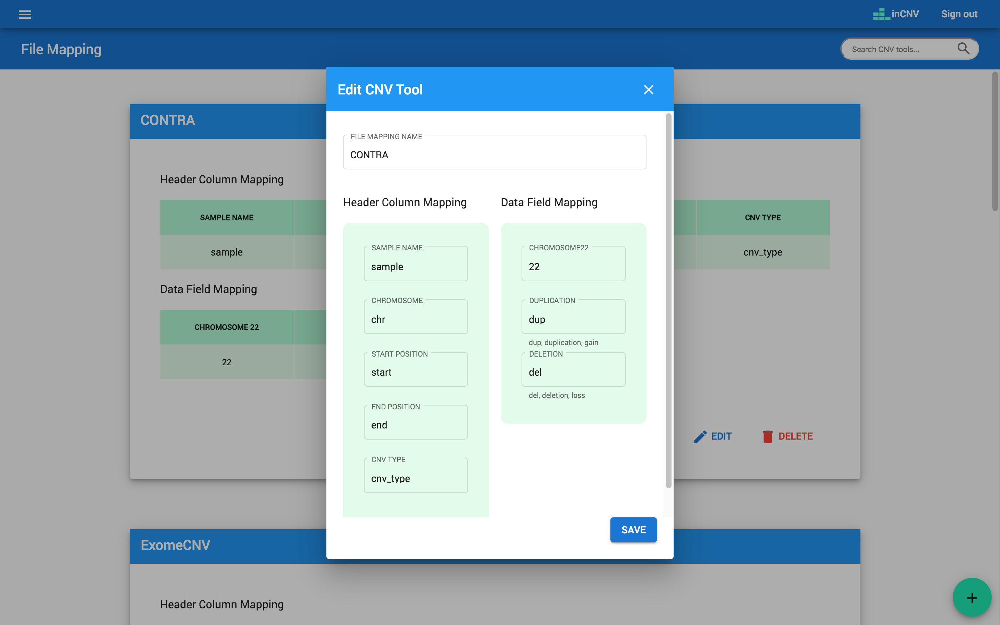
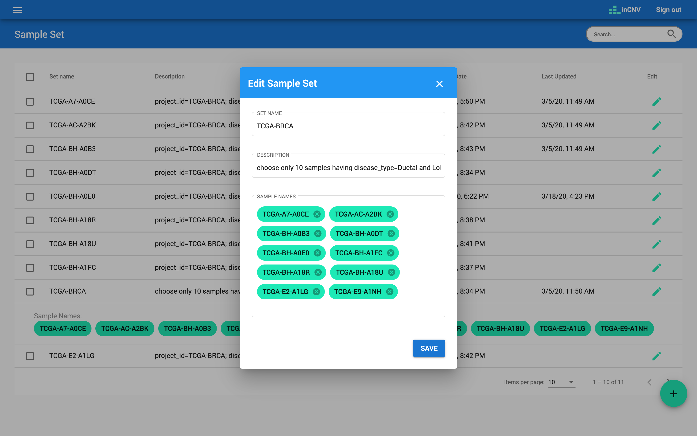
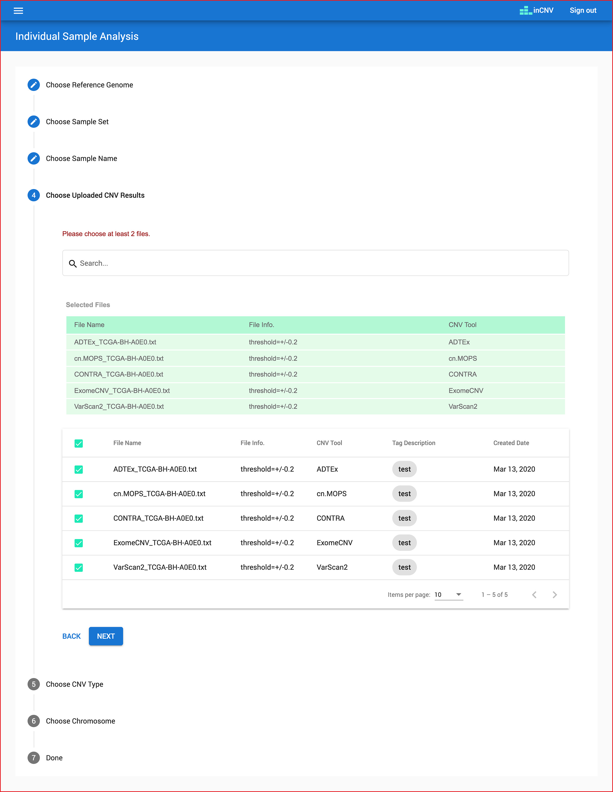

# inCNV

## Demo
Please visit `https://incnv.pintle.app`.
The user name is `test@gmail.com` and password is `123456`.
You can register your account and upload your files to play inCNV but the files will be expired in some peroid of time. More importantly, you need to remember your password. inCNV don't have the forget password feature. (I'm sorry. This part is still implementation).

## What is inCNV

The tool in the research paper published in the SAGE journal, [inCNV: An Integrated Analysis Tool for Copy Number Variation on Whole Exome Sequencing](https://journals.sagepub.com/doi/full/10.1177/1176934320956577).

inCNV is a web-based application accepting multiple CNV-tool results as input, integrate and prioritize captured CNVs with user-friendly interface. It help users analyze the importance of captured CNVs by annotating CNVs with genetic data from Ensembl, Database of Genomic Variants (DGV), ClinVar and Online Mendelian Inheritance in Man (OMIM) including their flanking sequences. Moreover, users can select interesting CNVs and export them as a plain text format to do further experimentally bio wet lab.

inCNV devide analyses into 2 modules: (1) Individual sample analysis, (2) Multiple sample analysis

- Individual sample analysis: It focuses on finding the more precise CNVs by integrating the results of multiple CNV detector tools on one sample.
- Multiple sample analysis: It focuses on finding the more precise CNVs by integrating the CNV results of multiple samples identified by a CNV tool.

## Impementation

Designed as a three-layer architecture with the (1) Frontend, (2) Backend, and (3) Database. They are build as Docker images and controlled with Docker compose and Nginx.

- **Frontend:**
  Developed by Angular framework, Angular material UI component and d3.js library. *To see the source code, please visit [incnv-frontend](https://github.com/saowwapark/incnv-frontend).* 

- **Backend:**
  Developed by Node.js and Express framework. The backend was adopted with some extension for reading FASTA file with _indexedfasta-js_ package (version 1.0.12) from JBrowse[2]. *To see the source code, please visit [incnv-backend](https://github.com/saowwapark/incnv-backend).*

- **Database:**
  inCNV acquired biological data from several sources in order to attach biological significance to the captured CNVs. These data were reformatted and linked together for CNV annotations. Therefore, we can apply them to align and visualize the given CNVs in the analysis result page. The public databases incorporated into inCNV included the UCSC26, DGV, ClinVar, Ensembl and HGNC.

  - The human reference genomes were obtained from UCSC26 to find flanking regions of a given CNV.
  - The DGV is used as the main reference of known CNVs.
  - inCNV incorporated the clinical variants with OMIM annotation from ClinVar
  - Gene-related information was obtained from Ensembl and HUGO Gene Nomenclature Committee at the European Bioinformatics Institute (HGNC).

  We used MySql as our DBMS and have 3 schemas (or databases) namely, inCNV, bio_grch37, bio_grch38.

  - `inCNV`: stores user information and uploaded CNV 
  - `bio_grch37`: stores annotations for reference genome GRCh37.
  - `bio_grch38`: stores annotations for reference genome GRCh38.

  Here's database schemas example from MySQLWorkbench
  

## Installation
Installing inCNV is straightforward as we have set up everything for you. There is no need to install or build the source code yourself. We have created all the necessary Docker images [here](https://hub.docker.com/r/saowwapark/incnv-frontend).

No need to clone the entire repository. Simply copy the [docker-compose directory](https://github.com/saowwapark/inCNV/tree/main/docker-compose) which includes of `docker-compose.yml`, `.env` and `reverse-proxy-nbinx.conf.template`. Then run `docker-compose.yml`.

1. Clone git.
```
git clone https://github.com/saowwapark/inCNV.git
```

2. Run `docker-compose.yml`
```
cd docker-compose
docker compose up -d
```

Here's captured image from Docker Desktop showing the result after running the container.


## How to open it
- After opening inCNV on browser with the default port,  `http://localhost:7001`, the inCNV backend will automatically download the datasources from [inCNV-datasource](https://github.com/saowwapark/inCNV-datasource) and display the status. Once the download is complete, it will redirect to the home page.


- The Docker container has two volumes, `databases-volume` and `datasources-volume`, to preserve data. Therefore, if users destroy the container with `docker compose down` (for example to save the host's memory), and recreate it, they won't need to re-add the data. The container will use the existing data from `databases-volume` and `datasources-volume`.

## Uninstallation

1. Stop Docker container and remove it
```
docker compose down
```

2. Remove unused images
```
docker system prune -a
````

3. Remove unused volumes
```
docker volume prune
```


## Updating
- **Updating annotations:**  
After [inCNV-datasource](https://github.com/saowwapark/inCNV-datasource) releases the new version, inCNV will automatically update bioinformatic annotation schemas, `bio_grch37` and `bio_grch38`. For `inCNV` schema storing uploaded CNV result files, file mappings, sample sets, and user information, inCNV will be remain the same.

- **Updating a new version of inCNV:**  
Users can easily update to a new version without reconfiguring settings. The data stored in the databases will remain intact thanks to the global Docker volumes named `datasources-volume` and `databases-volume`. To update, simply remove the old version and install the new one using the following command:

1. Stop and remove the existing Docker container.

```
docker compose -f file-location/docker-compose.yml down
```
2. Download the new version.
```
git clone https://github.com/saowwapark/inCNV.git
```

3. Start the new version.
```
docker compose -f file-location/docker-compose.yml up -d
```


## How to configure for advanced setting
*Note: you don't need to change anything to use inCNV. This section is for advanced users who need to modify Docker ports and volume names.*

Here's docker-compose.yml version 2.2.0

```
services:
  incnv-frontend:
    image: saowwapark/incnv-frontend:2.5.0
    container_name: incnv-frontend
    restart: always
    networks:
      - incnv-network
    ports:
      - ${FRONTEND_DOCKER_PORT}
    environment:
      - FRONTEND_PORT=${FRONTEND_DOCKER_PORT}
    command: /bin/sh -c "envsubst '$${FRONTEND_PORT}' < /etc/nginx/nginx.conf.template > /etc/nginx/nginx.conf && nginx -g 'daemon off;'"
  
  incnv-backend:
    image: saowwapark/incnv-backend:2.3.1
    container_name: incnv-backend
    restart: always
    environment:
      - NODE_ENV=prod
      - PORT=${BACKEND_DOCKER_API_PORT}
      - HOST=0.0.0.0
      - DB_HOST=${DATABASE_HOST}
      - DB_PORT=${DATABASE_DOCKER_PORT}
      - DB_USER=${DATABASE_USER_NAME}
      - DB_PASSWORD=${DATABASE_PASSWORD}
    ports:
      - ${BACKEND_EXTERNAL_API_PORT}:${BACKEND_DOCKER_API_PORT}
    networks:
      - incnv-network
    volumes:
      - datasources-volume:/usr/app/dist/volumes/datasources_volume
    depends_on:
      incnv-databases:
        condition: service_healthy
  incnv-databases:
    image: mysql:8
    container_name: incnv-databases
    restart: always
    networks:
      - incnv-network
    environment:
      - MYSQL_ROOT_PASSWORD=${DATABASE_PASSWORD}
    volumes:
      - databases-volume:/var/lib/mysql
    ports:
      - ${DATABASE_EXTERNAL_PORT}:${DATABASE_DOCKER_PORT}
    healthcheck:
      test: ["CMD", "mysqladmin" ,"ping", "-h", "localhost","-u","root","--password=${DATABASE_PASSWORD}"]
      timeout: 20s
      retries: 10
  incnv-reverse-proxy:
    image: nginx:latest
    container_name: incnv-reverse-proxy
    restart: always
    networks:
      - incnv-network
    depends_on:
      incnv-databases:
        condition: service_healthy
    ports:
      - ${NGINX_EXTERNAL_PORT}:${NGINX_PORT}
    volumes:
      - ./reverse-proxy-nginx.conf.template:/etc/nginx/reverse-proxy-nginx.conf.template
    environment:
      - NGINX_PORT=${NGINX_PORT}
      - FRONTEND_DOCKER_PORT=${FRONTEND_DOCKER_PORT}
      - BACKEND_DOCKER_API_PORT=${BACKEND_DOCKER_API_PORT}
    command: /bin/sh -c "envsubst '$${NGINX_PORT} $${FRONTEND_DOCKER_PORT} $${BACKEND_DOCKER_API_PORT}' < /etc/nginx/reverse-proxy-nginx.conf.template > /etc/nginx/nginx.conf && nginx -g 'daemon off;'"

volumes:
  databases-volume:
  datasources-volume:

networks:
  incnv-network: {}
```

Here's the environment variables in `.env`
```
# Frontend
FRONTEND_DOCKER_PORT=7002

# Backend
BACKEND_DOCKER_API_PORT=2000
BACKEND_EXTERNAL_API_PORT=2010

# Database
DATABASE_HOST=incnv-databases
DATABASE_DOCKER_PORT=3306
DATABASE_EXTERNAL_PORT=7004
DATABASE_USER_NAME=root
DATABASE_PASSWORD=rootpassword

# Reverse Proxy
NGINX_EXTERNAL_PORT=7001
NGINX_PORT=80
```

### Explain the configuration
From code above;
- Users can configure environment variables, represented as `${}` in `docker-compose.yml` file. These variables should be edited in the `.env` file. Modifying the `docker-compose.yml` file directly may disrupt the configuration. Ensure these changes are made before running `docker compose up -d`.
- Users can access database outside the Docker container via TCP/IP by the `DATABASE_EXTERNAL_PORT:7004` setting. For example users can utilize a visual database design tool like MySQLWorkbech, pointing to port `7004`.
- To change the port for accessing inCNV in a browser, modifying `NGINX_EXTERNAL_PORT` variable in `.env` file. For to open inCNV at `http://localhost:4008`, set `NGINX_EXTERNAL_PORT=4008`


## Demo Data

Users can download demo input files [here](./demo-data).

We modified the results files from _Zare, F. et al._[1] before uploading them into inCNV. We keep only necessary data for inCNV analysis and reformat the remain data to match with a [pre-defined CNV tool template](#file-mapping).

Those files were obtained from running multiple CNV detection tools against the exome of ten patients with breast cancer from the cancer genome atlas (TCGA) with BRCA project. The tools used for detecting CNVs were ADTEx, cn.MOPS, CONTRA, ExomeCNV31 and VarScan2. According to _Zare, F. et al._[1], Those tools have the thresholds of +/-0.2 to call CNVs.

The results files from _Zare, F. et al._[1] represented the CNV types of ADTEx, cn.MOPS and ExomeCNV with a standard CNV type number. ‘1’ = CNV deletion, ‘2’ = no CNV (normal), ‘3’ = CNV duplication, and more than ‘3’ = the amplification. For our demo data, we used number ‘1’ as CNV deletion and number ‘3’ and more as CNV duplication.
On the contrary, the CNV types of CONTRA and VarScan2 were represented by log2 ratio. Therefore, for our demo data, we used log-ratio > +0.2 for CNV duplication and log-ratio < - 0.2 for CNV deletion.

## Work flow

inCNV has data flow diagram (DFD) as below;


## Input data preparation

### Uploaded files

Before using inCNV, users have to upload CNV results from any CNV detector tool that matches with the pre-defined [CNV tool mapping](#file-mapping) and pre-defined [sample set](#sample-set).

Example: some part of CNV detection tool named CONTRA

```
sample	chr	start	end	cnv_type
TCGA-A7-A0CE	1	11868	14412	del
TCGA-A7-A0CE	1	14362	29806	del
TCGA-A7-A0CE	1	29553	33264	del
TCGA-A7-A0CE	1	30266	31109	del
TCGA-A7-A0CE	1	30365	30503	del
TCGA-A7-A0CE	1	36276	50281	dup
TCGA-A7-A0CE	1	69090	70008	del
TCGA-A7-A0CE	1	129080	134836	del
```

Upload component


The CNV result files have to be plain text with tab-delimitted format. The contents need to have at least 5 columns which having the meanings of sample name, chromosome, start position, end position and CNV type.

### File mapping

The ‘CNV tool mapping’ allows users to define input file formats, which will be used to map with the CNV results generated from any CNV detector tools. Users, however, need to reformat the result files to match with inCNV file template described below so that inCNV can understand the files.  


- **Header column mapping:** The header columns consist of 'SAMPLE NAME', 'CHROMOSOME', 'START POSITION', 'END POSITION', and 'CNV TYPE'. Users have to map column of any result file to them. For example, if a result file represents sample name with 'sample', we will set 'SAMPLE NAME' with 'sample'. If a result file represents chromosome with 'chr', we will set 'CHROMOSOME' with 'chr'.
- **Data field mapping:** The data fields needed to be mapped consist of 'CHROMOSOME22', 'DUPLICATION', and 'DELETION'. Users have to map content of any result file to them. For example, if a result file represents chromosome 22 with '22', we will set 'CHROMOSOME22' with '22'. If a result file represents duplication type of CNV with 'dup', we will set 'DUPLICATION' with 'dup'.\
  _Note: For duplication CNV type, inCNV can understand only the words: 'dup', 'duplication' and 'gain'. For deletion CNV type, inCNV can understand only the words: 'del', 'deletion' and 'loss'._

### Sample set

The ‘sample set’ allows users to define a group of samples they are interested in. At this component, users can indicate a set name, description and sample names of any sample set.



- The sample names have to match with data in 'SAMPLE NAME' column of the given result file.

## Analysis configuration

Users have to choose interesting criteria to analyze.

- **individaul sample analysis:** criteria namely a reference genome, a sample set, a sample name, many files, a CNV type and a chromosome.
  

- **multiple sample analysis:** criteria namely a reference genome, a sample set, many sample names, one file, a CNV type and a chromosome.

## Integreated CNV analyses

inCNV devides analyses into 2 modules: (1) Individual sample analysis, (2) Multiple sample analysis
use case

### Individual sample analysis

In this module, inCNV can help:
- Finding the more precise CNVs by integrating the results of multiple CNV detector tools on one sample.
- Finding CNVs not previously reported in case inCNV provides common overlapping CNVs but not match with DGV.
- Providing the CNV flanking region extraction which will extract the left and right flanking sequences of the CNV that can be used by biologists for primer design.

>>>Example


Moreover, when users hover or click at any charts, they will show pop-up dialog data belows.

>>>CNV Tool dialog showing inputted-file CNV


>>>Merged CNV dialog showing integrated CNV


>>>Selected CNV dialog showing chosen CNV to export


>>>Clicking at any bioinformatic green tag button linking to external datasource page.


>>>A Ensembl page from the green tag, `CLIP4`.


>>>A DGV page from the green tag, `nsv2658`.


>>>An OMIM searching page from the green tag, `613014`


### Multiple sample analysis

In this module, inCNV can help:
- Finding the more precise CNVs by integrating the CNV results of multiple samples identified by a CNV tool.
- Finding the relationship between the given group of samples having the same disease.
- Finding common CNVs within a group of samples having the same disease or de novo CNVs of a sample with in the same family or of the given sample set.
  - To do this, users can filter out the common CNVs and explore whether the remaining CNVs are unique for a specific sample and/or associated with the disease
- Finding a targeted sample is potential to have a specific disease. This can be done by the following steps:
  1. combining CNV results of our target with the results and of a sample set which having the same disease.
  2. searching genes related to specific disease.
  3. searching our target.
  4. searching the most common overlapping samples that include our target (our interesting sample).
  5. Then, if we can find enough the number of overlapping CNVs including our target’s CNVs, we may predict that the target is potential to have a disease and we need to perform biological wet lap to confirm again.

Example


## References

<a id="1">[1]</a>
Zare F, Dow M, Monteleone N, Hosny A, Nabavi S. An evaluation of copy number variation detection tools for cancer using whole exome sequencing data. Bmc Bioinformatics. 2017;18(1):286.\
<a id="2">[2]</a>
Buels R, Yao E, Diesh CM, et al. JBrowse: a dynamic web platform for genome visualization and analysis. Genome Biol. 2016;17:66.
